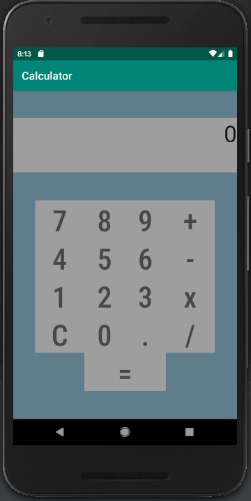
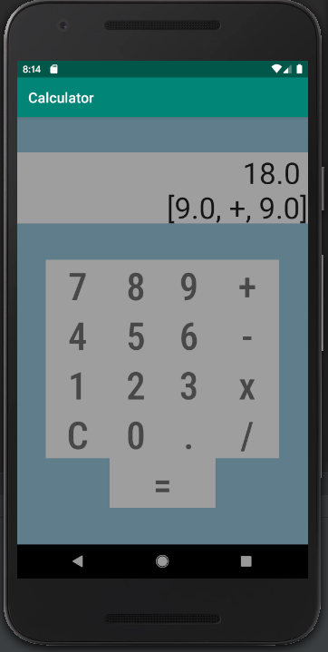

# Calculator
> A simple calculator application.

## Table of Contents
* [General Info](#general-info)
* [Screenshots](#screenshots)
* [Technologies](#technologies)
* [Setup](#setup)
* [Features](#features)
* [Status](#status)
* [Contact](#contact)

## General Info
This project was started to expose myself to Android development while putting into practice some Kotlin fundamentals.

## Screenshots

## Technologies
* Kotlin
* Android Studio

## Setup
Install the .apk file included here or build it from the source code.

## Features
Current features:
* Shows previous equation
* Calculates input left-to-right

To-do list:
* Implement a negative button
* Fix previous equation formatting

## Status
_Currently in progress_

## Contact
Created by [Warkah Scott](https://www.linkedin.com/in/warkahscott/) - feel free to contact me!
